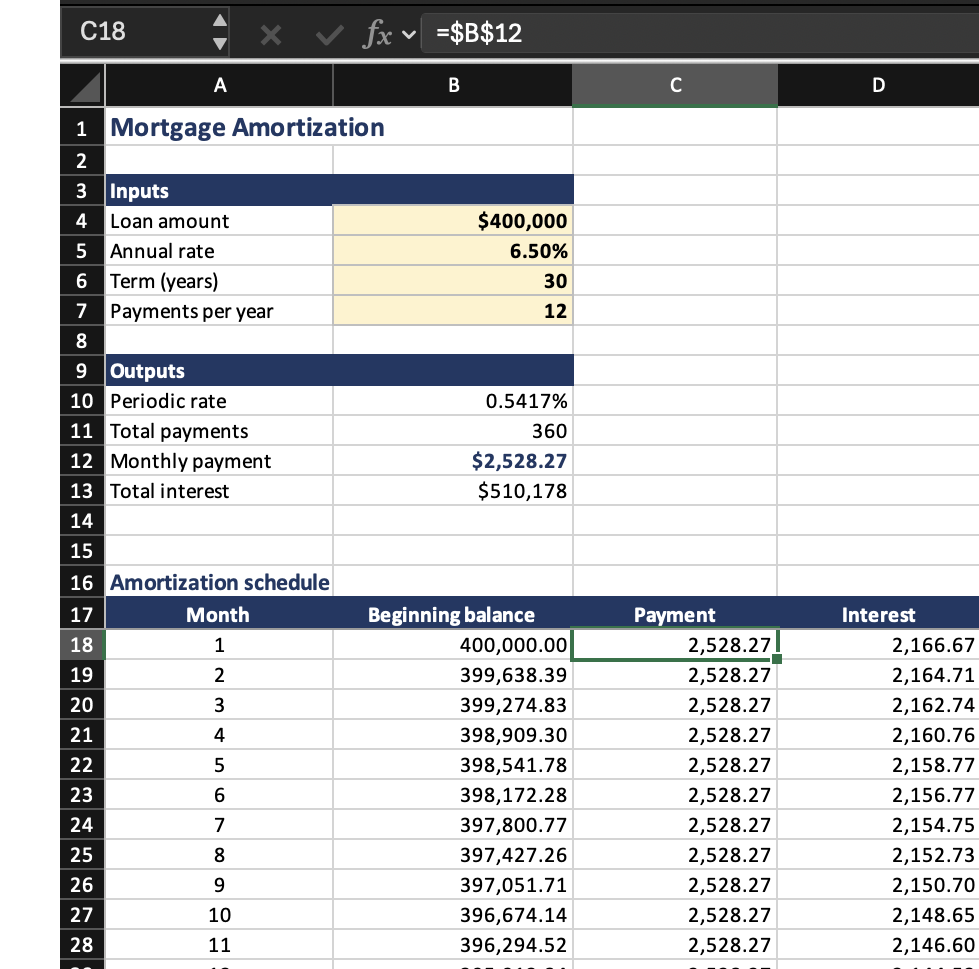
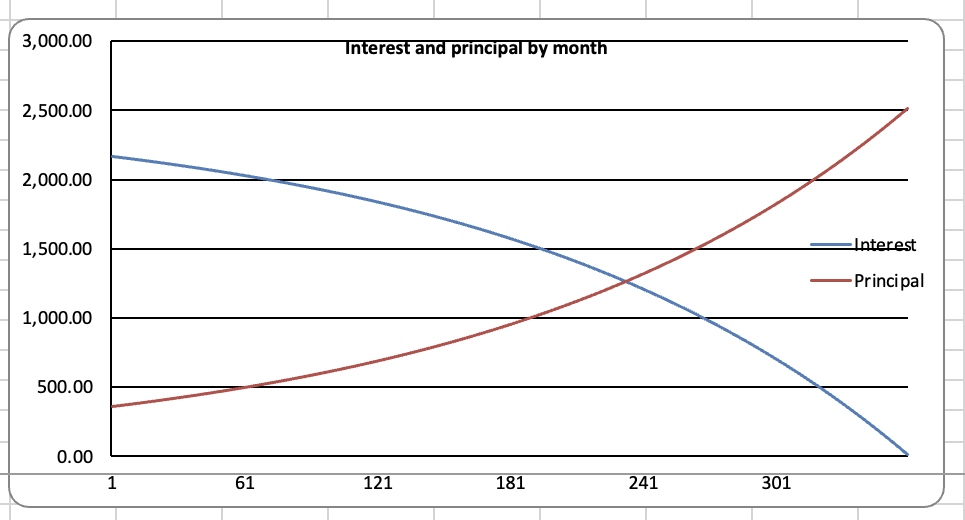
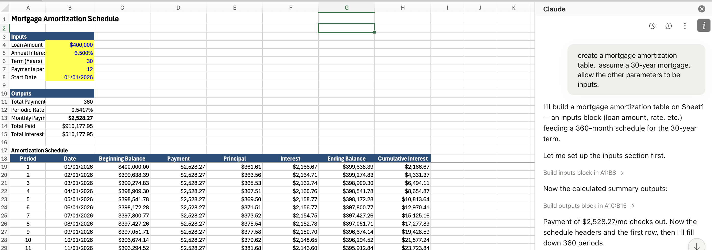

## Course topics

::: {.cards .cards-4}
::: {.card}
[Capital budgeting]{.card-title}

Free cash flow, NPV, IRR, incremental cash flows, multiple alternatives, real options, and
simulation. Sept 12
:::

::: {.card}
[Company valuation]{.card-title}

Two-stage DCF model (Sept 17) and multiples of comparables (Oct 1)
:::

::: {.card}
[Rates and portfolios]{.card-title}

Mean-variance optimization, the cost of capital, bond pricing and duration,
immunization. Oct 10
:::
::: {.card .card-blue}
[Wrap-Up]{.card-title}

Live in-class Q&A.  Oct 15
:::
:::

## Tools {.band-bottom}

::: {.cards .cards-2}
::: {.card}
[Excel]{.card-title}

Still the right tool for a tabular model that adds and subtracts, and the one
your colleagues can open, change, and argue with.

:::

::: {.card .card-blue}
[AI]{.card-title}

Everything else: fetching filings, estimating a beta, optimizing a portfolio,
running ten thousand simulations.
It also builds the workbook.
:::
:::

## Course materials {.plain-title}

Everything is posted at [mgmt648.kerryback.com](https://mgmt648.kerryback.com).

::: {.cards .cards-3}
::: {.card}
[Schedule]{.card-title}

The home page. Slides and files distributed here.
:::

::: {.card .card-blue}
[Syllabus]{.card-title}

Grading, meeting times, and what to prepare. Nothing outside class is collected.
:::

::: {.card}
[Free readings]{.card-title}

Welch's *Corporate Finance*, Damodaran's spreadsheets, SEC EDGAR, and the
learn-investments site. Nothing to buy.
:::
:::

# Excel

## Best practices — structure {.band-bottom}

::: {.steps}
1. Every assumption gets its own labeled cell, in one block at the top
2. Formulas reference those cells, never a number typed inside the formula
3. The same formula runs across every period of a projection
4. Every hardcoded number carries its source beside it
:::

::: {.note}
Write `=B5*(1+$B$6)`, not `=B5*1.05`. Source format: document, date, specific
reference — "Company 10-K, FY2025, page 45, revenue note."
:::

## Best practices — presentation {.plain-title}

| Convention | Rule |
|---|---|
| [Blue text]{style="color:#0000FF"} | Hardcoded inputs — the cells a reader is meant to change |
| [Black text]{style="color:#000000"} | Every formula and calculation |
| [Green text]{style="color:#008000"} | Links to another sheet in the same workbook |
| Currency | `$#,##0`, with units in the header: Revenue ($mm) |
| Percentages | One decimal. Valuation multiples as `0.0x` |
| Negatives | Parentheses, (123), not −123 |

Zero formula errors on delivery: no `#REF!`, `#DIV/0!`, `#VALUE!`, or `#NAME?`.

## Why the colors matter

::: {.cards .cards-2}
::: {.card}
The color convention is not decoration. It is how a reader knows, at a glance,
what they are allowed to change.
:::
::: {.card}
[For your reader]{.card-title}

Blue says "this is an assumption, argue with it." Black says "this follows from
the assumptions, do not touch it."
:::
:::

# AI

## The lab {.band-bottom}

::: {.steps}
1. Go to [lab648.kerryback.com](https://lab648.kerryback.com)
2. Username is your netid-648 (example: abc01-648)
3. Password is your student number, `S0...`
:::

::: {.note}
A Linux container on a cloud server, billed to the school. Security on it is
minimal — keep nothing personal there.
:::

## What is running there {.plain-title}

::: {.cards .cards-3}
::: {.card}
[The harness]{.card-title}

Claude Code, connected to GLM 4.7 — a capable and relatively inexpensive model
from Z.ai.
:::

::: {.card .card-blue}
[The software]{.card-title}

Python and its scientific libraries, plus skills for financial data,
spreadsheets, and slides.
:::

::: {.card}
[The screen]{.card-title}

File browser and terminal on the left; the prompt window at the foot of the
right-hand panel.
:::
:::

## Three things that will trip you up

::: {.cards .cards-3}
::: {.card}
[Refresh]{.card-title}

The file browser does not notice a new file on its own. Use the refresh button
above it.
:::

::: {.card .card-blue}
[No Excel in the lab]{.card-title}

Office is not installed. Double-clicking a workbook there does nothing.
:::

::: {.card}
[Download to open]{.card-title}

Workbooks come down to your laptop through the three-dots menu, and open in your
own Excel.
:::
:::

# AI and coding

## The large language model (LLM) only writes text {.plain-title}

::: {.lead}
The model cannot open a file, run a calculation, or fetch a filing. It reads
text and writes text. That is the entire capability.
:::

What makes it useful is the harness around it. The model emits a request to use
a tool; the harness runs the tool and reports the result back.

## The loop {.band-bottom}

::: {.steps}
1. The harness sends the prompt, the conversation, and the list of tools
2. The model answers: use tool X, with these arguments
3. The harness runs X and reports the result back
4. The model decides what comes next — another tool, or an answer for you
:::

::: {.note}
On the lab, GLM writes a Python file, runs it at the terminal, reads the output,
and revises. Four tool calls before you see anything.
:::

## What that produces

::: {.cards .cards-3}
::: {.card}
[Excel workbooks]{.card-title}

Written cell by cell with Python: inputs as numbers, formulas as formulas.
:::

::: {.card .card-blue}
[Charts and figures]{.card-title}

Any chart style, custom annotations, labels, fonts
:::

::: {.card}
[Word and PowerPoint]{.card-title}

Real files with editable text, not pictures of them.
:::

::: {.card .card-blue}
[Data analysis]{.card-title}

Data fetched, merged, filtered, aggregated --- statistics and regressions
:::

::: {.card}
[Advanced data analysis]{.card-title}

Simulations, optimizations, machine learning
:::

::: {.card .card-blue}
[Web apps]{.card-title}

A page someone else can use, from a description of what it should do.
:::
:::

## Example {.band-bottom}

Try this prompt:

> Build an Excel workbook containing a mortgage amortization table. 
> Put the loan amount, rate, and term in labeled input cells at the top. > > Include a chart of the amount going to interest and the amount going to principal each month.

## What comes back {.image-right .no-title}

::: {.image-panel}

:::

::: {.content-panel}
[The workbook]{.eyebrow}

Inputs in labeled cells, an outputs block below them, 360 rows of schedule.

The selected payment cell holds `=$B$12`, not 2,528.27.

Change the rate and the whole sheet recalculates.
:::

## And the chart it asked for {.plain-title}

{width=62% fig-align="center"}

::: {.note}
A chart object bound to the cells, not a picture pasted in. Change the rate and
the crossover moves with it.
:::

## Claude inside Excel {.plain-title}

::: {.lead}
There are also Claude, ChatGPT, and CoPilot plugins for Excel , from `Home → Add-ins`. The chat window sits inside the workbook.  
:::

{width=56% fig-align="center"}

::: {.note}
They need paid accounts or particular types of license agreements.  We will not use them.
:::

# Best practices for using AI

## Plan before you act

For any complex operation, ask AI to plan first, or ask it what the best way is to do something, before it begins to work.

::: {.cards .cards-2}
::: {.card}
[Planning pulls the knowledge in]{.card-title}

*Plan how you will do this before you start.* The plan puts the relevant
considerations into the conversation, and it answers in light of those rather
than from base rates.
:::

::: {.card .card-blue}
[Planning breaks the work up]{.card-title}

Steps you can check one at a time. Failures stay small and local instead of
surfacing at the end, when everything downstream is already wrong.
:::
:::

## Misunderstandings and bad assumptions {.band-bottom}

::: {.cards .cards-2}
::: {.card}
[The problem]{.card-title}

Errors usually come from 

- AI misunderstood what you wanted, or
- The task could be done in multiple ways, you did not specify, and AI chose the wrong path

:::

::: {.card .card-blue}
[What to say:]{.card-title}

 - Tell me what you are about to do 
 - Tell me what you did
 - Was there any ambiguity in my instructions?  Did you make any choices we did not discuss?
:::
:::

## Numbers need code

- AI has gotten better at arithmetic, but it is still not to be trusted at math --- it is trained to predict language 
- Always ask it to run code if you need a number
- It may not be good at predicting what should follow "what is 32 times 17?" but it is very good at generating code "x = 32 * 17; print(x)"

## Ask why your idea is bad, not why it is good

Training on human feedback teaches that agreement earns high ratings. Ask "is
this valuation sound?" and it will find reasons that it is.

::: {.note .note-plum}
Invert it. *What is the strongest argument that this project should be
rejected?* 
:::

## Use independent agents as critics {.band-bottom}

::: {.cards .cards-2}
::: {.card}
[AI is not a good self-critic]{.card-title}

Ask AI in the same conversation to evaluate its work.  It will review its own reasoning and conclude it is sound.
:::

::: {.card .card-blue}
[Start a new conversation or ask for a subagent]{.card-title}

A new conversation or a subagent will not see the prior reasoning.  It will look at it "with a fresh set of eyes."
:::
:::

## Hallucinations

- Hallucinations are much less frequent now than a few years ago
- Hallucinating code is really not an issue
- Ask for web search and a source for any fact
- The greatest risk is asking for an obscure fact that it cannot find via a web search

## Verify and retain code {.band-bottom}

::: {.cards .cards-2}
::: {.card}
[Check the outputs]{.card-title}

We don't usually check AI code by reading it.  We check small cases where we can verify "by hand" (using AI to help with that too).
:::

::: {.card .card-blue}
[And keep what works]{.card-title}

Keep code that has been vetted.  Tell AI to use it again the next time.
:::
:::

